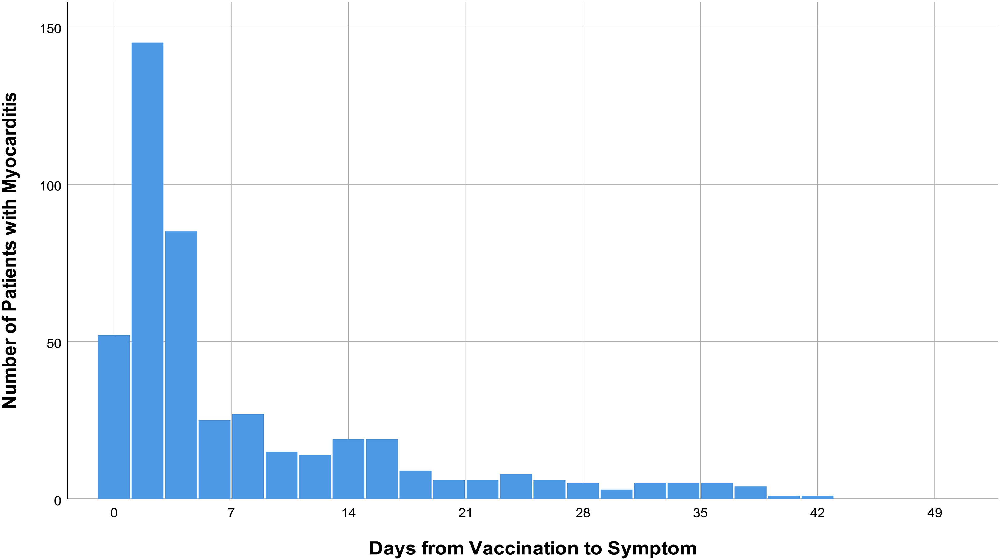
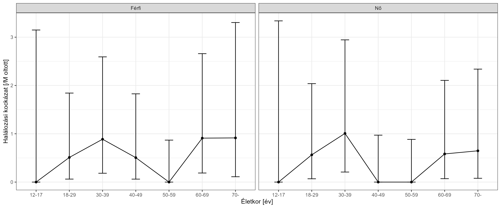

A kockázat-haszon mérlegelés egy példájáról
================
Ferenci Tamás (<https://www.medstat.hu/>)

*„Az egyetlen gyógyszer aminek nincs mellékhatása az, aminek nincs
főhatása sem.”*

*(Gyógyszerész mondás)*

------------------------------------------------------------------------

További esszéim: <https://www.medstat.hu/#esszek>

------------------------------------------------------------------------

2023 közepén megjelent a magyar sajtóban egy érdekes cikk, „Tényleg
léteznek oltáskárosultak?”
[címmel](https://24.hu/tudomany/2023/07/09/covid-19-koronavirus-vakcina-vedooltas-mellekhatasai-oltaskarosultak/).
Az írásnak egyetlen mondatát tenném most szóvá, nem azért, mert a
többihez ne lehetne észrevételeket fűzni, de pont emiatt jobb, ha
fókuszáltak maradunk, márpedig erre az egyetlen mondatra is sok –
véleményem szerint tanulságos – gondolatot lehet felfűzni.

Az ominózus idézet így hangzott: „A koronavírus-oltásoknál egyébként
megjelenésük óta már több vádat is sikerült cáfolni. »Egy időben
különösen a gyerekeknek adott vakcináknál szívizommal kapcsolatos
mellékhatásokat vélelmeztek egyesek. Mostanra bebizonyosodott, hogy
ezeknek az állításoknak semmiféle valóságalapjuk nincs« – tette hozzá a
professzor.”

Először is rögzítsük, hogy ez a megfogalmazás hibás: a
szívizomgyulladással kapcsolatos vélelmeknek olyannyira van
valóságalapjuk, hogy az oltóanyag alkalmazási előirásában is
[szerepelnek](https://www.ema.europa.eu/hu/documents/product-information/comirnaty-epar-product-information_hu.pdf):
„A Comirnaty oltást követően szívizomgyulladás (miokarditisz) és
szívburokgyulladás (perikarditisz) fokozott kockázata áll fenn”. A
kérdésnek ma már komoly irodalma van, számos nemzetközi vizsgálattal,
mely megerősíti ezt; fogok is ilyenre hivatkozni a következőkben.

Jelen írásomban azonban nem magára a hibára akarok fókuszálni, mert
ennél sokkal izgalmasabb dolgok is feltárhatóak e mondat kapcsán. Nem
fogok teljesen pontos számításokat végezni, mert az komolyabb
matematikai apparátust igényelne, és csak elterelné a figyelmet a
lényegről: célom inkább az alapgondolat bemutatása. Ennek megfelelően a
konkrét számokat nem kell túl komolyan venni, de úgy hiszem, hogy a
kirajzolódó tendenciák is nagyon tanulságosak lesznek már így is. És a
négy alapműveleten túl másra nem lesz szükségünk!

Bár a bemutatott számítás egy nagyon konkrét szituációra (adott
gyógyszerre, adott mellékhatásra, adott alkalmazási helyzetre)
vonatkozik, azt remélem, hogy számos *általános tanulság* is levonható
belőle, melyek jól hasznosíthatóak bármilyen gyógyszernél, bármilyen
helyzetben. A fontos a megfelelő gondolkodási keret, a
kockázat/haszon-mérlegelés jól végiggondolt alkalmazása.

Kezdjük az alapoknál: hogyan ítéljük meg egy oltás – vagy általában,
bármilyen gyógyszer – biztonságosságát? Nem lehet elégszer hangsúlyozni,
hogy e kérdésnek kizárólag kockázat/haszon mérlegelés kontextusában van
értelme. Nem létezik olyan, hogy „biztonságos gyógyszer” meg olyan, hogy
„veszélyes gyógyszer”: egy kevés mellékhatással bíró gyógyszer is lehet
elfogadhatatlan (ha egy rendkívül ritka és nagyon enyhe betegség ellen
véd) és egy sok mellékhatással bíró is lehet kiváló (ha egy gyakori és
halálos betegség ellen véd). E fogalmakat tehát mindig mérlegelésben
kell vizsgálni.

Egy COVID-vakcina esetén a mérleg kockázat oldalán vannak az oltás
mellékhatásai, haszon oldalán a COVID-megbetegedés és -halálozás
kockázatának csökkenése. Ezek persze tovább bonthatóak: mellékhatás
lehet, hogy egyfajta nagyon súlyos allergiás reakció, az anafilaxia lép
fel az oltás beadása után közvetlenül, hogy a már emlegetett
szívizomgyulladás lép fel, trombózist okoz az oltás stb. A haszon
oldalon megjelenik a megbetegedés, különösen a súlyos megbetegedés
elkerülése miatt kevesebb szenvedés, a maradványtünetekkel gyógyulás
kockázatának csökkenése és persze mindenekelőtt a koronavírus-fertőzés
miatt halálozás kockázatának a csökkenése.

Ahogy már volt róla szó, mostani írásomban a kockázat oldalról a
szívizomgyulladást fogom vizsgálni. De mit tekintsünk a haszon oldalról?
Világos, hogy minél több tényezőt veszünk figyelembe, annál előnyösebb
lesz a kép a vakcinára nézve. Én most egy „lehető legrosszabb helyzet”
típusú számítást fogok végezni, ami az oltásbiztonságnál amúgy is
fontos: mindenhol az oltás kárára tévedek, hogy a végén azt lehessen
mondani, hogy ennél csak jobb lehet a helyzet. Ennek megfelelően a
haszon oldalon csak és kizárólag a COVID-halálozás megelőzését fogom
tekinteni. Semmilyen más hasznát nem tekintem az oltásnak; ebből
kiemelendő, hogy figyelmen kívül hagyom, hogy az COVID-megbetegedés
*maga is* járhat szívizomgyulladással (aminek egyébként egyáltalán nem
elhanyagolható a gyakorisága, és az oltás utáni szívizomgyulladásnál
[még súlyosabb is](https://bmjmedicine.bmj.com/content/2/1/e000373) a
lefolyása). Ezeknek, ha nem is az egészét, hiszen az oltás nem 100%-os
hatásosságú, pláne nem a megbetegedés ellen, de egy részét egy pontos
számításban le kellene vonni az oltás által okozott
szívizomgyulladásokból, hiszen ezeket az oltás pedig megelőzi – de én
ezt most nem fogom megtenni, hogy ezzel is az oltás kárára tévedjek.
Szintén nem veszem figyelembe az oltás esetleges ún. indirekt előnyeit:
bizonyos oltóanyagok védelmet nyújtanak az ellen is, hogy az oltott
terjessze a betegséget, ezáltal az oltás nem csak őt védi, hanem a
környezetét is. Kérdés lehet, hogy itt van-e egyáltalán ilyen hatás, de
ebbe azért nem megyek bele, mert egyszerűen azt feltételezem, hogy ilyen
hatás nincs, úgyhogy ha tévedek is, akkor is az oltás kárára teszem.

Természetesen konzisztens leszek, és a szívizomgyulladásnál is csak a
halálozást fogom végpontként tekinteni, ezeket fogjuk számolni a
következőkben.

Ezen a ponton be kell hoznunk a konkrét számokat! Bár az egyes cikkekben
természetszerűleg van szóródás, javaslom, hogy a továbbiakhoz vegyük
alapul Cho és mtsai
[cikkét](https://academic.oup.com/eurheartj/article/44/24/2234/7188747),
melyben a dél-koreai tapasztalatokat dolgozták fel. Ez egy rendkívüli
munka: szinte a teljes, 12 év feletti dél-koreai lakosság, 44 millió
ember adatait elemezték (a nagyságrendek kedvéért: az adatok között csak
Pfizer-rel oltottból van 25 millió első dózis, 23 millió második dózis,
11 millió harmadik dózis; az összes oltásból együttvéve több mint 100
millió dózist követtek nyomon!), hihetetlen alapossággal, EKG-, labor-,
képalkotó- és szövettani eredményeket közölnek stb.

Külön ki kell emelni két pontot, amivel igyekeztek – egészen párját
ritkító gondossággal – begyűjteni minden oltás okozta
szívizomgyulladásos esetet. Az egyik, hogy nem csak az oltás után
jelentett szívizomgyulladásokat vizsgálták meg, hanem *minden* hirtelen
szívhalálban oltás beadása után elhunyt embert felboncoltak,
*függetlenül* attól, hogy volt-e bármilyen gyanú – hátha lesz köztük
olyan, akinek valójában, akár fel sem ismert, szívizomgyulladása volt. A
másik, hogy az oltás után felismert szívizomgyulladások közül minden
olyan egyértelmű vagy valószínűsíthető esetet, amire az oltáson kívül
más kóroki magyarázatát nem tudtak találni, az oltáshoz kötődőnek
tekintettek, és csak azokat az eseteket zárták ki, ahol találtak más
kórokozót. Ez a számolás szintén az oltás kárára fog tévedni, hiszen
lesz olyan eset, ahol valójában van más tényező, csak azt nem tudták
megtalálni (milliónyi vírus, baktérium, gomba, parazita okozhat
szívizomgyulladást többek között, amiket nem lehet mind megvizsgálni),
míg olyan jóval kevesebb lesz, ha egyáltalán előfordul, hogy azt hitték,
hogy van más kóroki tényező, de valójában nincs. Azaz végeredményben el
fogunk az oltás okozta esetként számolni olyanokat is, amiket nem az
oltás okozott; ezt egyáltalán nem szűrték ki és vonták le.

Ez utóbbi megjegyzésre talán érdemes kicsit részletesebben is kitérni.
Miről van szó? Az oltás által *okozott* szívizomgyulladások száma nem
más, mint az oltottak körében jelentkező szívizomgyulladások száma,
*mínusz* azon szívizomgyulladások száma, ami *ugyanazon* emberek körében
jelentkezett *volna*, ha nem kaptak *volna* oltást. A probléma
természetesen az, hogy jó esetben is csak az előbbit ismerjük, az
utóbbit elvileg lehetetlen. (Sajnos sokan gondolják azt, és erre
néhányan rosszhiszeműen rá is erősítenek, mintha nullát kellene kivonni.
Természetesen nem: minden betegség, ami előfordul úgy általában, az
előfordul az oltás után is, még akkor is, ha az oltás egy fia esetet
[nem okozott](https://vedooltas.blog.hu/2013/03/18/mi_a_kulonbseg_507).
Illusztratív párbeszéd: „Tudok olyanról aki az oltás beadását követő egy
héten belül meghalt!!!44!! És ez szerinted így önmagában gyanús? Naná,
hogy az!! Oké, tehát akkor szerinted egyedül az az oltóanyag nem gyanús,
ami egy hétre halhatatlanná teszi az oltottakat?”…) Az epidemiológiai
vizsgálatok igyekeznek ezt kiküszöbölni [valamilyen
módszerrel](https://vedooltas.blog.hu/2014/03/22/a_vedooltasok_biztonsagossaganak_valos_vizsgalati_modszerei_ii_resz),
igyekeznek meghatározni, hogy mennyi lett volna oltás nélkül az
előfordulás, ezt szokták háttérrátának hívni, és ezt kivonni az
eredményből. Itt azonban semmi ilyen nem történt! Ezért mondtam, hogy ez
az oltás kárára téved.

Érdemes megnézni az alábbi ábrát a cikkből, ami mutatja a
szívizomgyulladásos esetek előfordulását az oltás óta eltelt idő
függvényében:

Jól látszik az oltás által okozott csúcs, de az is, hogy utána nem megy
le nullába a görbe – nagyjából a 20. nap környékén stabilizálódik, és
onnantól vízszinteshez közeli módon fut tovább. Hogy lehet ez? Miért nem
megy le ez nullába? Kérdezhetné valaki, de gondoljuk meg: még jó, hogy
nem megy le nullába, az azt jelentené, hogy a beadott oltás örök időkre
megvéd a szívizomgyulladástól… (Ugye a kutya ott van elásva, hogy az
ábrán az *összes* szívizomgyulladás száma van, egyedül a más
kórokozósakat levonva, nem az oltás által *okozott* szívizomgyulladások
száma.) Ha a 20. nap utáni adatokra képzeletben húzunk egy vízszintes
egyenest, akkor jó közelítéssel pont a háttérrátát kapjuk! Ez az, amit
le kellett volna vonni, hiszen ezek a nem az oltás által okozott esetek
– de ebben a kutatásban ezt nem tették meg, így ezeket az eseteket is
elszámoljuk az oltás kontójára. (Az külön érdekes, hogy természetesen ez
a vízszintes vonal az egész görbén ott van. Érdemes belegondolni,
például az oltás utáni 4. napon is lesznek olyan esetek, amiket nem az
oltás okoz, miközben itt semmi kérdés nincs, hogy az oltás okoz ilyet,
és a 4. napon aztán pláne egyértelmű ez – de a képzeletbeli egyenes
alatti esetek *még ott is* a háttérráta részei!) A dologban egyébként az
a szép, hogy ha felcsapjuk az
[irodalmat](https://academic.oup.com/jid/article/225/9/1569/6484617),
akkor azt látjuk, hogy a szívizomgyulladás háttérrátája nagyjából 1-2
per 100 ezer emberév ([más országok adatai
szerint](https://www.globalvaccinedatanetwork.org/Data-Dashboards/Background-Rates-Dashboards/GVDN-AESI-Background-rates-2015%E2%80%932020)
még ennél is több), amit átszámolva, 42 napon belül 10 millió
oltásonként kb. 10-20 ilyet várunk. Itt van 104 millió oltás, ez tehát
legkevesebb 100 eset a 42 nap alatt, azaz kétnaponként – mert a fenti
ábrán minden oszlop két nap – nagyjából 5 eset. És nézzük meg: elég jó
közelítéssel tényleg ennyi az, ahol a képzeletben behúzott vízszintes
vonalunk húzódik! A koreai vizsgálatban egyébként 480
szívizomgyulladásos eset volt, ez a fenti ábrán az oszlopok összege,
tehát a minimum 100, oltás utáni, de nem oltás által okozott eset
egyáltalán nem hanyagolható el – és ez az, amit nem vontak le!

Még egyetlen megjegyzés ehhez. Természetesen a halálozásra is lehetne
egy ilyen görbét rajzolni, sőt, nekünk igazából az lenne a fontos,
hiszen majd a halálozások számát fogjuk használni; ami miatt itt mégis
ezt használtam, az egész egyszerűen az áttekinthetőség: a nagyobb
eseményszámok miatt itt jobb látszik, hogy mi történik. A fenti
gondolatmenet azonban, a saját számaival, a halálozásokra is pontosan
ugyanúgy érvényes – beleértve azt is, hogy ennek az elhanyagolása az
oltás kárára tévedés.

Természetesen elképzelhető az oltás javára tévedés is, azaz, hogy nem
találnak meg oltás által okozott szívizomgyulladásos esetet (nem ismerik
fel egy hirtelen szívhalálról, hogy az, vagy például valaki úgy vészel
át egy nagyon súlyos lefolyású szívizomgyulladást, és hal is végül bele,
hogy nem keres fel orvost), ezek azonban elég erőltetett szcenáriók, a
fenti, ellentétes irányú tévedeseknél mindenesetre egész biztosan kisebb
súlyúak.

Megjegyzendő, hogy minden egyes oltás után 42 napon át gyűjtötték a
szívizomgyulladásos eseteket: azt korábban is lehetett biológiai
megfontolások alapján sejteni, hogy az oltás kiváltotta
szívizomgyulladás túlnyomórészt a beadást követő egy-két héten belül
jelentkezik, de erre most már tapasztalati adatunk is van a fenti ábra
révén, mivel a görbe már 20-30 napnál is gyakorlatilag teljesen lapos.
Immár tehát bizonyítékunk is van arra, hogy a 42 nap miért biztos, hogy
szinte minden oltás okozta esetet megfogott. (Természetesen a „na de mi
van, ha aztán egyszercsak két év múlva mégis elkezd újra előjönni??!!??”
típusú kérdésre ez nem ad választ. Erre ilyen módszerrel nem is lehet,
hiszen – mint épp az imént láttuk – már 42 napnál is a nem oltás adta
szívizomgyulladások dominálnak, képzelhetjük mi történne két év alatt.
Ilyenre csak összehasonlító jellegű vizsgálattal lehet válaszolni, igaz,
azoknak meg megvannak a maguk nehézségei, erre még az írásom legvégén
röviden kitérek.)

Mindezek után nézzük az eredményeket! Egyetlen mondatban összefoglalva:
44,3 millió ember összesen 103,8 millió dózissal (túlnyomórészt Pfizer,
kisebbrészt AstraZeneca és Moderna, nagyon kis részt Janssen) történő
beoltása után 21 halálos mellékhatást tapasztaltak.

Ha ezt olyan módon vetítjük át a magyar lakosságra, hogy feltételezzük,
hogy az emberenként beadott dózisok száma és oltásfajták közti
megoszlása ugyanaz, akkor azt kapjuk, hogy Magyarországon az összes 12
év feletti lakos beoltása várhatóan 4,1 halálos mellékhatással jár.
Látszólag tehát meg is van a kockázat-haszon mérlegelés: akkor érdemes
ilyen oltási programot csinálni, ha oltás híján a járványba 4-nél több
ember halna bele!

Bármennyire is abszolút egyértelmű, nyugodtan mondhatom, elsöprő a
helyzet – nem nagyon kell magyarázni, hogy sajnos a járványba 4-nél
többen halnának bele – bármennyire is igaz tehát, hogy a mérleg egészen
drasztikusan és drámaian az oltás oldalára billen, azért azt fontos
rögzíteni, hogy *akkor is* mérlegelésről van szó. Ez az első fontos
tanulság. A védőoltások nem tökéletesen hatásosak és nem tökéletesen
biztonságosak, az alkalmazásuk létjogosultságát – bármilyen más
gyógyszerhez hasonlóan – a kockázat/haszon mérlegelés kell, hogy adja.
Külön kiemelendő, hogy a védőoltások használatának is lesznek
kárvallottjai, sőt, áldozatai is – más kérdés, hogy a *nem*
alkalmazásuknak még sokkal-sokkal-sokkal-sokkal több lenne, legalábbis a
fenti számítás szerint. De ez akkor is egy mérlegelés!

Szóval a helyzet egyértelmű, de – és itt érünk el a történet egyik
legizgalmasabb részéhez. A fenti adatok *egyben* tekintették az egész
populációt! Miközben sem a kockázat, sem a haszon nem állandó, ráadásul
a dolgot az teszi különösen izgalmassá, hogy a kettő ellentétes irányban
mozog: a védőoltás haszna egyre kisebb ahogy egyre fiatalabb
korosztályokat nézünk (hiszen ők oltás nélkül is egyre kevésbé
valószínű, hogy belehaljanak a COVID-ba, tehát minél fiatalabbak, annál
kevesebbet profitálnak az oltásból), viszont a kockázata egyre nagyobb
(mert a szívizomgyulladás gyakoribb fiatalabb korban, pláne férfiaknál,
elsősorban a magasabb tesztoszteron-szint
[miatt](https://journals.lww.com/ajandrology/Fulltext/2021/23040/Testosterone,_cardiomyopathies,_and_heart_failure_.2.aspx)),
igaz, ez utóbbit ellensúlyozhatja, hogy a fiatalok körében jobb a
szívizomgyulladás túlélési esélye. A kettőt összerakva nem nehéz látni,
hogy mi lehet itt a probléma: nem fordulhat elő, hogy a fiataloknál már
nem ugyanaz a mérleg, mint összességében? Átfordulhat akár az
ellenkezőjére is…?

Nézzük meg! A tényadatok alapján; a hivatkozott vizsgálat ugyanis
szerencsére közli a vakcinához kötött szívizomgyulladásos halálozások
előfordulását életkoronként és nemenként lebontva is! (Ennek részleteit
az [1. függelék](#a-koreai-vizsgálat-halálos-kimenetelű-esetei)
tartalmazza.) Íme:

| Nem          | Életkor      | Oltottak száma \[M fő\] | Halálos szívizomgyulladás \[fő\] | Halálos szívizomgyulladás \[fő/M oltott\] |
|:-------------|:-------------|------------------------:|---------------------------------:|:------------------------------------------|
| Mindösszesen | Mindösszesen |                    44.3 |                               21 | 0.47 (0.29 - 0.73)                        |
| Mindösszesen | 12-17        |                     2.1 |                                0 | 0.00 (0.00 - 1.78)                        |
| Mindösszesen | 18-29        |                     7.4 |                                4 | 0.54 (0.15 - 1.38)                        |
| Mindösszesen | 30-39        |                     6.3 |                                6 | 0.95 (0.35 - 2.07)                        |
| Mindösszesen | 40-49        |                     7.7 |                                2 | 0.26 (0.03 - 0.94)                        |
| Mindösszesen | 50-59        |                     8.4 |                                0 | 0.00 (0.00 - 0.44)                        |
| Mindösszesen | 60-69        |                     6.9 |                                5 | 0.72 (0.23 - 1.69)                        |
| Mindösszesen | 70-          |                     5.5 |                                4 | 0.73 (0.20 - 1.87)                        |
| Férfi        | Mindösszesen |                    22.2 |                               12 | 0.54 (0.28 - 0.95)                        |
| Férfi        | 12-17        |                     1.2 |                                0 | 0.00 (0.00 - 3.15)                        |
| Férfi        | 18-29        |                     3.9 |                                2 | 0.51 (0.06 - 1.84)                        |
| Férfi        | 30-39        |                     3.4 |                                3 | 0.89 (0.18 - 2.59)                        |
| Férfi        | 40-49        |                     4.0 |                                2 | 0.51 (0.06 - 1.83)                        |
| Férfi        | 50-59        |                     4.2 |                                0 | 0.00 (0.00 - 0.87)                        |
| Férfi        | 60-69        |                     3.3 |                                3 | 0.91 (0.19 - 2.66)                        |
| Férfi        | 70-          |                     2.2 |                                2 | 0.91 (0.11 - 3.30)                        |
| Nő           | Mindösszesen |                    22.1 |                                9 | 0.41 (0.19 - 0.77)                        |
| Nő           | 12-17        |                     1.1 |                                0 | 0.00 (0.00 - 3.34)                        |
| Nő           | 18-29        |                     3.5 |                                2 | 0.56 (0.07 - 2.04)                        |
| Nő           | 30-39        |                     3.0 |                                3 | 1.01 (0.21 - 2.94)                        |
| Nő           | 40-49        |                     3.8 |                                0 | 0.00 (0.00 - 0.97)                        |
| Nő           | 50-59        |                     4.2 |                                0 | 0.00 (0.00 - 0.88)                        |
| Nő           | 60-69        |                     3.4 |                                2 | 0.58 (0.07 - 2.11)                        |
| Nő           | 70-          |                     3.1 |                                2 | 0.65 (0.08 - 2.34)                        |

E ponton meg kell beszélni még egy kérdést. Ez minden orvosi
vizsgálatnál felmerül, de más esetekben talán a szőnyeg alá lehet
söpörni, mondván, hogy nincs nagy jelentősége, de itt, a nagyon alacsony
számok miatt, nem ez a helyzet. A probléma a következő: amint látjuk,
2,1 millió fiatal körében sem fordult elő oltás kiváltotta
szívizomgyulladásos halálozás. Mondhatjuk akkor, hogy *biztosan* 0% ez a
kockázat? Nem egészen, hiszen mi van, ha valójában igenis okoz
halálozást – de mondjuk csak minden 5 milliomodik oltottnál? Ezt nem
zárja ki igazán a fenti adat! Másik oldalról, azt, hogy mondjuk minden
százezrediknél okozzan, azt már erősen kizárja. Ezt ragadja meg az
úgynevezett konfidenciaintervallum fogalma, ami zárójelben szerepel a
halálozási arány mögött. Ez az a tartomány, ami – a fenti értelemben –
kompatibilis a tapasztalt adatokkal, tehát a konfidenciaintervallum
megadja, hogy mi az, ami azért nagy megbízhatósággal kizárható és mi az,
ami nem. A konkrét példánál: igen, nem biztos, hogy 0% a valódi érték –
de az azért nagy megbízhatósággal kizárható, hogy 1,78/millió értéknél
nagyobb lenne. (A pontos értelmezés az, hogy ha ennél nagyobb lenne
valójában, akkor már nagyon valószínűtlen lenne, hogy pusztán a véletlen
ingadozás szeszélye folytán az történjen meg, hogy a 2,1 millió
oltottból sincs egyetlen halálozás sem.) A konfidenciaintervallum pontos
logikáját a [2. függelék](#a-konfidenciaintervallum-fogalma) nagyon
részletesen elmagyarázza.

Ami hamar feltűnhet a táblázatból, hogy valójában nem tapasztaltuk azt,
hogy a fiatal férfiak jobban érintettek lennének. A magyarázat nagyon
egyszerű: igenis jobban érintettek a *megbetegedésben*
(érzékeltetésként, a koreai vizsgálat szerint 12-17 év közötti fiúknál
53 szívizomgyulladás jut egymillió oltottra, míg a teljes populáció
körében ez mindössze 11), viszont – végső soron józan ésszel sem
meglepő, és a szakirodalomból is
[ismert](https://www.nature.com/articles/s41598-022-05951-z) módon –
nekik jobb a gyógyhajlamuk, így végeredményben halálozásból nem lesz
több a körükben.

Talán még jobban érzékelhetővé tehetjük a fenti eredményeket, ha
grafikusan is ábrázoljuk (a vonaldarabkák a konfidenciaintervallumot
adják meg):

<!-- -->

Most már minden a kezünkben van, hogy mindezt átvetítsük a magyar
adatokra – de immár életkori és nemi lebontásban is! Az átvetítéskor
ismét feltételezzük, hogy az emberenként beadott dózisok száma és
oltásfajták közti megoszlása ugyanaz mint Dél-Koreában. Ez szerencsére
nem egy túl megszorító körülmény, mert a koreai oltások típusainak
összetétele és a dózisok oltottankénti száma nem tér el nagyon a
magyarétől, ráadásul így nem kell újabb feltételezéseket tennünk (a [3.
függelék](#a-dél-koreai-és-magyar-oltottsági-adatok) tartalmazza ennek
részleteit). Mindenesetre az eredmények úgy értendőek, hogy a koreai –
szerencsére tehát reális, és a magyartól nem nagyon eltérő –
„oltásprofilt” alkalmazva itthon is:

| Nem          | Életkor      | Halálos szívizomgyulladás \[fő/M oltott\] | Magyar lakosok száma \[M fő\] | Halálos szívizomgyulladások várható száma teljes átoltottság esetén \[fő\] |
|:-------------|:-------------|:------------------------------------------|------------------------------:|:---------------------------------------------------------------------------|
| Mindösszesen | Mindösszesen | 0.47 (0.29 - 0.73)                        |                          8.59 | 4.08 (2.52 - 6.23)                                                         |
| Mindösszesen | 12-17        | 0.00 (0.00 - 1.78)                        |                          0.59 | 0.00 (0.00 - 1.05)                                                         |
| Mindösszesen | 18-29        | 0.54 (0.15 - 1.38)                        |                          1.33 | 0.72 (0.20 - 1.83)                                                         |
| Mindösszesen | 30-39        | 0.95 (0.35 - 2.07)                        |                          1.25 | 1.19 (0.44 - 2.59)                                                         |
| Mindösszesen | 40-49        | 0.26 (0.03 - 0.94)                        |                          1.58 | 0.41 (0.05 - 1.48)                                                         |
| Mindösszesen | 50-59        | 0.00 (0.00 - 0.44)                        |                          1.26 | 0.00 (0.00 - 0.56)                                                         |
| Mindösszesen | 60-69        | 0.72 (0.23 - 1.69)                        |                          1.26 | 0.91 (0.29 - 2.12)                                                         |
| Mindösszesen | 70-          | 0.73 (0.20 - 1.87)                        |                          1.32 | 0.97 (0.26 - 2.47)                                                         |
| Férfi        | Mindösszesen | 0.54 (0.28 - 0.95)                        |                          4.08 | 2.21 (1.14 - 3.86)                                                         |
| Férfi        | 12-17        | 0.00 (0.00 - 3.15)                        |                          0.30 | 0.00 (0.00 - 0.96)                                                         |
| Férfi        | 18-29        | 0.51 (0.06 - 1.84)                        |                          0.68 | 0.35 (0.04 - 1.26)                                                         |
| Férfi        | 30-39        | 0.89 (0.18 - 2.59)                        |                          0.64 | 0.57 (0.12 - 1.67)                                                         |
| Férfi        | 40-49        | 0.51 (0.06 - 1.83)                        |                          0.80 | 0.40 (0.05 - 1.46)                                                         |
| Férfi        | 50-59        | 0.00 (0.00 - 0.87)                        |                          0.62 | 0.00 (0.00 - 0.54)                                                         |
| Férfi        | 60-69        | 0.91 (0.19 - 2.66)                        |                          0.56 | 0.51 (0.10 - 1.48)                                                         |
| Férfi        | 70-          | 0.91 (0.11 - 3.30)                        |                          0.48 | 0.43 (0.05 - 1.57)                                                         |
| Nő           | Mindösszesen | 0.41 (0.19 - 0.77)                        |                          4.51 | 1.84 (0.84 - 3.49)                                                         |
| Nő           | 12-17        | 0.00 (0.00 - 3.34)                        |                          0.29 | 0.00 (0.00 - 0.96)                                                         |
| Nő           | 18-29        | 0.56 (0.07 - 2.04)                        |                          0.64 | 0.36 (0.04 - 1.31)                                                         |
| Nő           | 30-39        | 1.01 (0.21 - 2.94)                        |                          0.61 | 0.61 (0.13 - 1.79)                                                         |
| Nő           | 40-49        | 0.00 (0.00 - 0.97)                        |                          0.78 | 0.00 (0.00 - 0.76)                                                         |
| Nő           | 50-59        | 0.00 (0.00 - 0.88)                        |                          0.64 | 0.00 (0.00 - 0.57)                                                         |
| Nő           | 60-69        | 0.58 (0.07 - 2.11)                        |                          0.70 | 0.41 (0.05 - 1.47)                                                         |
| Nő           | 70-          | 0.65 (0.08 - 2.34)                        |                          0.85 | 0.55 (0.07 - 1.99)                                                         |

Fontos kiemelni, hogy ezek az adatok arra vonatkoznak, ha *mindenkit*
beoltunk.

Ezzel teljeskörűen a végére értünk a „kockázat” oldalnak. Na de mi a
helyzet a „haszon” oldalon?

Mivel a fenti számok a kockázat oldalon úgy értendőek, hogy ennyivel
*több* halálozás lesz a két forgatókönyv *között* (tehát ha mindenkit
beoltunk, meg ha senkit sem), így a haszon oldalt is e két lehetőség
különbségére nézve kell megadni. Hánnyal kevesebben halnak meg a
járványban, ha mindenkit beoltunk, ahhoz képest, mintha senki nem lenne
beoltva?

Erre a kérdésre azonban egyáltalán nem könnyű válaszolni. Kezdjük ott,
hogy a válasz nem az, hogy hányan halnának meg oltás nélkül, hiszen az
oltás hatásossága nem 100%, még a halálozás ellen sem. (Ráadásul időben
is változik, csökken, erre mindjárt visszatérünk még.) A nagy magyar
védőoltás-hatásossági vizsgálat, a HUN-VE 3 [adatai
szerint](https://www.frontiersin.org/articles/10.3389/fimmu.2022.919408/full)
a Pfizer-, Moderna- és AstraZeneca oltások hatásossága halálozás ellen
két oltás után életkortól és oltás óta eltelt időtől függően 60-90%
körül van, harmadik oltás után 90-100% körül egészen 120 napig az oltás
után. Ha mondjuk 70%-kal számolunk, akkor azt azt jelenti, hogy ha oltás
nélkül 1000-en halnának meg, akkor az oltás 700 embert ment meg, ez lesz
a haszon oldal, nem az 1000.

Igen ám, de hányan halnának meg oltás nélkül? Itt már sokkal jobban
bonyolódik a kérdés. Két tényező számít: 1) hányan fertőződnének meg? 2)
a fertőzöttek milyen arányban halnak bele a betegségbe oltás nélkül? Ez
eddig tiszta, a probléma az, hogy ezek viszont iszonyatosan sok
tényezőtől függnek (milyen variáns terjed épp? fertőzőképesebb?
veszélyesebb? milyen lezárások vannak? milyen gyógyszeres kezelési
lehetőségek vannak? stb. stb.), amelyekre mind-mind feltételezni kellene
valamit, hogy válaszoljunk a kérdésre. (Első ránézésre meglepő lehet,
hogy egy oltás kockázat-haszon mérlege függ mondjuk attól, hogy milyen
lezárások vannak. De ha jobban meggondoljuk, ez logikus: ha mindenkit
bezárunk otthon, akkor oltás *nélkül* sem fognak sokan meghalni, ami
lenyomja az oltás hasznát, és így persze, hogy befolyásolja – a konkrét
esetben rontja – a kockázat-haszon mérleget!)

A számos feltevés helyett egy alternatív megoldás, ha azt nézzük, hogy
hányan haltak meg *ténylegesen* Magyarországon. Ezzel azt mondjuk, hogy
a fenti kérdések mindegyikére az a válasz, hogy „ahogy Magyarországon
történt”, amilyen lezárások voltak, amilyen variáns terjedt, amilyen a
lakosok egészségi állapota stb. Ez első ránézésre teljesen rendben is
van, hiszen ha itt gyártunk kockázat-haszon mérleget, akkor ez a lehető
legrelevánsabb, de ettől még fontos látni, hogy például egy jövőbeli
helyzetre nem feltétlenül alkalmazható módosítás nélkül. Egyébként az
oltás okozta szívizomgyulladásnál is jobb lett volna magyar adatot
használni, a koreait is csak kényszerből vettem elő, mert magyar adat
semmilyen nem volt – ami nagy baj, de sajnos [nem teljesen
meglepő](https://github.com/tamas-ferenci/GondolatokAJarvanyugyiAdatokKozleserol);
szerencsére pont ebben, tehát, hogy az oltás mennyire okoz
szívizomgyulladást, nem nagyon várható, hogy hatalmas különbségek
legyenek az országok között (persze, például genetikai okokból, nem is
teljesen kizárható). Csakhogy egy gond is van ezzel a megközelítéssel:
az, hogy menet közben elkezdtünk oltani az országban. Ebből fakadóan a
tényleges halálozási számainkban nem csak azok a – variánsok,
gyógyszerek, lezárások stb. miatti – ingadozások lesznek benne, amikre
tudatosan azt mondtuk, hogy legyenek is, hanem az oltás miattiak is.
(Pláne, hogy az elhunytak oltottsági státuszáról nincs is adatunk.) De
itt most éljünk egy bátor huszárvágással: *mégis* nézzük a halottak
tényleges számát, *de* azzal az, ebből közvetlenül fakadó, igen fontos
megjegyzéssel, hogy ez innentől egy *abszolút alsó korlát* a haszonra:
ennyien még – részbeni – oltással *együtt is* meghaltak, miközben nekünk
az kell, hogy oltás *nélkül* mennyien haltak volna meg – az tehát ennél
csak nagyobb lehet. (Ez lényegében megint egy jókora tévedés az oltás
kárára.)

Egyetlen dologra figyelni kell. A halottak részletes életkori és nemi
adatai a napi gyorsjelentésben érhetőek el, viszont az joggal vethető
fel, hogy ők meg nem biztos, hogy tényleg mind a járvány áldozatai (most
félretéve [azt a
kérdést](https://github.com/tamas-ferenci/ExcessMortEUR), hogy
egyáltalán hogyan definiálható pontosan, hogy ki a járvány áldozata),
hiszen őket nem a rendes halottvizsgálati eljárás szerint sorolták be
halálokilag. Szerencsére 2020-2022-re vonatkozóan már [közölte a
KSH](https://www.ksh.hu/stadat_files/nep/hu/nep0009.html) a rendes
haláloki besorolási eredményeket is! Itt életkori és nemi lebontás ugyan
nincsen, de kérésre ezeket is leválogatja a KSH. Én ezt megtettem
(ügyszám: 20231019-118888); a lenti adatok ezeket a számokat tükrözik,
így fontos hangsúlyozni, hogy ezek már a rendes haláloki besorolással
kapott eredmények, így mentesek attól a problémától, hogy a napi
gyorsjelentés felülbecsli a halálozások számát. (Egyébként valamennyivel
[tényleg](https://github.com/tamas-ferenci/ExcessMortEUR?tab=readme-ov-file#%C3%B6sszevet%C3%A9s-a-jelentett-hal%C3%A1loz%C3%A1ssal),
a különbség kb. 17% – tehát a jelenség létezik, de azért az sem igaz,
hogy itt többszörös eltérésekről lenne szó.)

Van azonban még egy (de most már tényleg utolsó!) probléma ezzel
kapcsolatban. Milyen hosszú időszak halottainak számát vegyük
összehasonlítási alapként? Ezt csak az oltási stratégiával összhangban
lehet megválaszolni. Ha például az oltás életre szóló védettséget ad,
akkor – egy ilyen ragályosságú betegség esetén – nyugodtan
feltételezhetjük, hogy a megfertőződés kockázata közel 100%, és így a
haszon számításához egyszerűen a halálozási arányt kell alapul venni.
Vagy, másik végletként, ha az oltás egy évre védelmet nyújt, de utána
megszűnik a védettség, akkor egy évnyi halálozási adatot kell alapul
venni (nem 100% megfertőződéssel tehát). Az a gond, hogy a valóságban a
COVID-oltás adta védelem a kettő között van: nem tart örökké, de nem is
szűnik meg nyomtalanul egy év után. Aztán ott van az a probléma, hogy ez
részben oltási stratégia függvénye is: elképzelhető, hogy azt tervezzük,
hogy beadunk három oltást, és utána abbahagyjuk a programot (ez is lehet
racionális: így már mindenkinek lesz egy alapimmunitása, kevésbé baj, ha
végigmegy a járvány a populációt), de talán életszerűbb, ha azt vesszük,
hogy megkapja mindenki a három oltást, és utána évente, ősszel egy
emlékeztető oltást, az influenzához hasonlóan. Vagy esetleg ezt tenni,
de csak kockázati csoportok esetén?

Talán a fenti is érzékelteti, hogy itt nagyon szétfolynak a lehetőségek,
szinte végtelen opció van. Éppen ezért az alábbi táblázat két szélső
lehetőséget mutat: feltünteti az összes halott számát (2020-2022-ből),
és ugyanezt úgy is, hogy leosztja egy évre:

| Nem          | Életkor      | Az oltás kockázata \[fő\] | COVID-halálozás \[fő\] | COVID-halálozás \[fő/év\] |
|:-------------|:-------------|:--------------------------|-----------------------:|--------------------------:|
| Mindösszesen | Mindösszesen | 4.08 (2.52 - 6.23)        |                  41491 |                   13826.8 |
| Mindösszesen | 12-17        | 0.00 (0.00 - 1.05)        |                      6 |                       2.0 |
| Mindösszesen | 18-29        | 0.72 (0.20 - 1.83)        |                    161 |                      53.7 |
| Mindösszesen | 30-39        | 1.19 (0.44 - 2.59)        |                    412 |                     137.3 |
| Mindösszesen | 40-49        | 0.41 (0.05 - 1.48)        |                   1375 |                     458.2 |
| Mindösszesen | 50-59        | 0.00 (0.00 - 0.56)        |                   3383 |                    1127.4 |
| Mindösszesen | 60-69        | 0.91 (0.29 - 2.12)        |                   8499 |                    2832.3 |
| Mindösszesen | 70-          | 0.97 (0.26 - 2.47)        |                  27655 |                    9216.0 |
| Férfi        | Mindösszesen | 2.21 (1.14 - 3.86)        |                  21256 |                    7083.5 |
| Férfi        | 12-17        | 0.00 (0.00 - 0.96)        |                      2 |                       0.7 |
| Férfi        | 18-29        | 0.35 (0.04 - 1.26)        |                     95 |                      31.7 |
| Férfi        | 30-39        | 0.57 (0.12 - 1.67)        |                    255 |                      85.0 |
| Férfi        | 40-49        | 0.40 (0.05 - 1.46)        |                    943 |                     314.3 |
| Férfi        | 50-59        | 0.00 (0.00 - 0.54)        |                   2259 |                     752.8 |
| Férfi        | 60-69        | 0.51 (0.10 - 1.48)        |                   5312 |                    1770.2 |
| Férfi        | 70-          | 0.43 (0.05 - 1.57)        |                  12390 |                    4129.0 |
| Nő           | Mindösszesen | 1.84 (0.84 - 3.49)        |                  20235 |                    6743.3 |
| Nő           | 12-17        | 0.00 (0.00 - 0.96)        |                      4 |                       1.3 |
| Nő           | 18-29        | 0.36 (0.04 - 1.31)        |                     66 |                      22.0 |
| Nő           | 30-39        | 0.61 (0.13 - 1.79)        |                    157 |                      52.3 |
| Nő           | 40-49        | 0.00 (0.00 - 0.76)        |                    432 |                     144.0 |
| Nő           | 50-59        | 0.00 (0.00 - 0.57)        |                   1124 |                     374.6 |
| Nő           | 60-69        | 0.41 (0.05 - 1.47)        |                   3187 |                    1062.1 |
| Nő           | 70-          | 0.55 (0.07 - 1.99)        |                  15265 |                    5087.0 |

(Forrás: Központi Statisztikai Hivatal (www.ksh.hu)
Covid19_halálozás_korcsoportos_2020_2022 nevű, egyedi kérésre
összeállított táblázatos adatállomány.)

Az egy évre leosztott adat megint durva torzítás az oltás kárára, hiszen
ne feledjük, hogy a kockázat rovatot olyan adatok alapján számoltuk,
amelyben szinte mindenki kap második oltást (92,8%) és elég sokan
harmadikat is (41,6%). Ha ezt mindössze egy évnyi halottal vetjük egybe,
az olyan mintha vagy azt feltételeznénk, hogy egy év után nulla az oltás
védőhatása a halálozás ellen is, vagy azt, hogy minden egyes 12 év
feletti lakos minden egyes évben 2,5 oltást kap – egyik feltételezésnek
sem sok köze van a valósághoz. (Természetesen figyelembe vehetnénk azt
is, hogy időben hogyan gyengül az oltás adta védelem, de ez újabb
feltételezéseket igényelne.)

Ezzel lényegében megkaptuk a kockázat/haszon-mérleget: nincs más
dolgunk, mint a COVID-halálozások számát beszorozni az oltás
hatásosságával, ez lesz a haszon, majd ezt összevetni az
oltás-kockázattal. Mivel a számítás során az oltás hasznát mindenhol
inkább alul-, a kockázatát meg felülbecsültük, így ez – ahogy
szándékosan terveztük is – egy vélhetően igen óvatos mérleg.

Egyfelől visszaköszön, amit korábban is láttunk: ha minden 12 év
felettit beoltottunk volna, akkor – a koreai adatok alapján – kb. 4
halálozás lett volna az országban szívizomgyulladás miatt. A járvány
miatt meg meghalt 40 ezer…

Viszont! Ha megnézzük az egyes csoportokat (a statisztikusok úgy szokták
mondani: rétegeket), akkor azt látjuk, hogy ha csak egyetlen egy is, de
egy van, ahol mégis cinkes a helyzet. És ez az érdekes: *annak ellenére
is*, hogy összességében meg nagyon egyértelmű a mérleg! De mégis, a 12
és 17 év közötti fiúknál, bár a mérleg a legvalószínűbb számítás szerint
még itt is az oltások felé billen, de az abszolút különbség már elég
kicsi. A léptékek itt már hasonlóak, legextrémebb számításban akár össze
is érnek, így a kockázat/haszon-mérleg kérdésessége a COVID-oltások
kapcsán a fiatalabb korosztályokban jogosan felmerülő, vizsgálandó
kérdés. (Ez igaz lehet a 12 év alatti korosztályra, bár ott még kevesebb
információnk van.) Statisztikai értelemben véve épp az a probléma az
ilyen rétegekben, hogy az oltás kockázata is nagyon kicsi és az oltás
haszna is nagyon kicsi, és azt a legnehezebb empirikusan, egy véges
méretű minta alapján megmondani, hogy két nagyon kicsi számból melyik a
kisebb. (Természetesen ne feledjük, hogy abban is az oltás ellen
csalunk, hogy haszon alatt most *csak* a halál megelőzését tekintjük,
noha pont ebben a korosztályban mondjuk a sokszervi gyulladásos
szindróma, a PIMS/MIS-C egyáltalán [nem
elhanyagolható](https://akjournals.com/view/journals/650/162/17/article-p652.xml).)

Levonhatjuk tehát a második, nagyon fontos tanulságot: az, hogy
összességében tekintve a populációt nagyon, akár drasztikusan egyik
irányba dől a mérleg, még nem jelenti azt, hogy ne lehetnének olyan
részcsoportok, ahol mégsem ilyen egyértelmű a helyzet!

Egyetlen, de nagyon fontos kiegészítő kommentár ehhez a mondathoz.
Természetesen az *össz*-kockázatra akkor is van korlátunk. Tehát az
igaz, hogy attól még, mert populációs szinten mondjuk 1 per 1 millió fő
a kockázat, lehet olyan részcsoport, ahol ennél nagyobb – de akkor ennek
a létszáma is kisebb kell legyen! Minél nagyobb a kockázat ebben a
csoportban, annál inkább. Tehát igen, lehet ugyan ettől még 2 per 1
millió valamely alcsoportban a kockázat, 10 per 1 millió, sőt, elvileg
akár olyan csoport is elképzelhető, amelynek tagjai körében 100% az
oltás kockázata – de akkor meg ez a csoport legfeljebb 1 főből állhat
minden 1 millió lakosra. Ettől még nagyon fontos feladat az ilyen
csoportok azonosítása, épp azért, mert náluk elképzelhető, hogy másképp
néz ki a kockázat-haszon mérleg, mint a populáció egészében és ebből
fakadóan elképzelhető, hogy az oltásra vonatkozó ajánlás is más kell
legyen – a fentiekben, az életkori és nemi lebontással, lényegében pont
egy ilyen vizsgálatot kíséreltünk meg!

Maradjunk még egy pillanatra az utolsó oszlopoknál, mert ehhez is
kapcsolódik még egy fontos megállapítás. Ezek az oszlopok azt kívánják
illusztrálni, hogy mekkora a járvány jelentette kockázat (és ebből
fakadóan az oltás haszna). Azt a táblázat is mutatja, hogy ez nem
állandó életkor és nem szerint; amit azonban nem mutat a táblázat, hogy
függhet más, további jellemzőktől is, például a társbetegségektől. (Ezt
a problémát enyhíti, ha ezek a jellemzők összefüggnek az életkorral,
ahogy például a társbetegségek erősen – ez esetben az életkor
valamennyire ezek hatását is tükrözi.) Van azonban ennek még egy fontos
jellemzője, amit a táblázat mutat: hogy nem feltétlenül állandó időben
sem! Egy járvány lehet épp csendesebb, vagy tombolhat, ami rámutat még
egy dologra, legyen ez a harmadik tanulság: a kockázat/haszon-mérleg nem
egy statikus, kőbe vésett dolog, hanem dinamikus, azaz időben változik,
változhat. És ennek megfelelően folyamatosan felül kell vizsgálni:
elképzelhető, hogy pontosan ugyanazon mellékhatás-kockázat (hiszen az
nem függ a járvány intenzitásától) ide vagy oda dőlő mérleget jelent, a
járvány súlyosságától függően – ezt is figyelembe kell venni a
kockázat/haszon mérlegelésnél, nem csak a különböző rétegeket.

És még egyetlen megjegyzés a végére. Az oltás kockázatai között most
egyedül a szívizomgyulladás következtében fellépő halálozást
tekintettük. Ez persze teljes mértékben indokolt, ha egyszer a
szívizomgyulladásról akarunk beszélni (ami most a célunk volt). De azért
az emberben felmerül a gondolat: miért nem nézünk más betegségeket? Mi
van, ha mást is okoz az oltás, akár olyat is, amibe bele lehet halni? Ez
nem irracionális felvetés: még ha egy ilyen összehasonlításban, mint a
mostani, azt is találjuk, hogy az oltás százszor kisebb halálozási
kockázatú, de mi van, ha ezer ilyen összehasonlítást végezhetünk?! És
mindegyikben *ugyanahhoz* a COVID-halálozáshoz viszonyítjuk a
*különböző* mellékhatás-halálozásokat? Ez így nyilván félrevezető! E
felvetésre két választ lehet adni. Az egyik, hogy a mellékhatás-figyelő
rendszerek nem találtak ilyen kockázatot; erre persze lehet azt mondani,
hogy valaki nem bízik abban, hogy ezek megtalálják ezeket a
kockázatokat, de erre épp a szívizomgyulladás a biztató példa: azt is az
ilyen rendszerek találták meg! Csakúgy mint a trombózis-kockázatot,
csakúgy mint az anafilaxia-kockázatot. Ezeket mind a hivatalos
mellékhatás-figyelő rendszerek vették észre, vizsgálták ki, és
jelentették. Ezek tehát biztató példák arra nézvést, hogy az ilyen
rendszerek igenis képesek ezeket a kockázatokat azonosítani. De ha
valaki ezzel nem elégszik meg, akkor elvileg kérhet egy radikálisabb
módosítást, ami viszont biztosan megválaszolja ezt a kérdést is: azt,
hogy az oltottak körében is az *összes* halálozást számoljuk (haláloktól
függetlenül). A kérés – a fenti értelemben – jogos, csak azért vigyázni
kell, hogy ne kérjünk lehetetlent. A gond ugyanis az, hogy ha ezt
kérjük, akkor kiesik a kezünkből egy fontos eszköz, ami itt még
(félig-meddig) megvolt, jelesül, hogy orvosilag tudtunk dönteni arról,
hogy mi az amit (okozatilag) az oltás váltott ki. A kérésnek azonban
*pont* az a lényege, hogy ezzel *ne* törődjünk, ne kategorizáljuk a
halálozásokat, hanem *mindent* számoljunk. Innentől viszont már csak az
oltatlan csoporthoz viszonyítás működik, hogy el tudjuk dönteni, hogy az
oltás okoz-e bajt. Mi ebben a lehetetlen? – kérdezhetné valaki.
Csakugyan, annak önmagában semmi akadálya, hogy megszámoljuk a
halálozások előfordulását oltottak és oltatlanok között. Tudok is magyar
kutatást hozni, ami ezt megtette: egy [hazai cikk
szerint](https://www.mdpi.com/2076-393X/10/7/1009) például 2021.
április 1. és június 20. között, a járvány egy durva szakaszában, a
Pfizerrel oltottak körében 4 804-en haltak meg az összesen nagyjából 200
ezer emberév alatt (24,7 halál per ezer emberév), míg az oltatlanok
körében 18 387-en a 630 ezer emberév alatt (29,3 halál per ezer
emberév). Akkor tehát az oltás immár végképp bizonyítottan, minden
ellenvetést megválaszoló módon is látványosan jót tesz?

Sajnos azonban ez sem ilyen egyszerű! A probléma az, hogy az oltottak és
az oltatlanok nem *csak* az oltottság tényében térnek el. Ráadásul
mindkét irányban lehetnek különbségek: lehetnek szempontok, amik szerint
az oltottak nagyobb halálozási kockázatúak (erre maga a cikk is ad
adatot: a Pfizerrel oltottak több mint 10 évvel voltak idősebbek
átlagosan mint az oltatlanok, 11,1%-uk volt cukorbeteg, míg az
oltatlanoknak csak 4,2%-a stb.), de más szempontok szerint meg
alacsonyabb kockázatúak (például egy majdnem halálos stroke vagy
autóbaleset másnapján valószínűleg senkit nem fognak beoltani, ami
fordítva nézve azt jelenti, hogy az oltottak csoportjában nem lesz
olyan, aki nemrég szenvedett stroke-ot, vagy autóbalesetet). A kérdés
tehát nem a megszámolás, hanem az értelmezés: ha olyan csoportokat
hasonlítunk össze, amelyek nem *csak* az összehasonlítás tárgyában
(jelen esetben az oltottságban) térnek el, akkor onnantól kezdve, ha
találunk is különbséget a kimenetben (a halálozásban), nem fogjuk tudni,
hogy az mi miatt van: az oltottság miatt, az oltottsággal együtt járó
egyéb eltérések miatt, vagy ezek valamilyen keveréke miatt? Ezt a
jelenséget szokták magyarban is gyakran használt angol szóval
[confounding-nak](https://tamas-ferenci.github.io/FerenciTamas_AzOrvosiMegismeresModszertanaEsAzOrvosiKutatasokKritikusErtekelese/)
nevezni. Elvileg akár még az is lehet, hogy az az oltottak halálozása
ugyan kisebb, de ettől még az oltás veszélyes – ha az oltottak
halálozása, ha nem kaptak volna oltást, *még kisebb* lett volna! És bár
a konkrét magyar adatokban nem ezt láttuk, de fordítva is elképzelhető:
hogy az oltottak halálozása nagyobb, de az oltás mégis jó – ha nélküle
*még nagyobb* lett *volna* a halálozás. Ez lényegében a korábban vázolt
probléma, hogy a „mi lett volna, ha” forgatókönyvet nem ismerjük. Erre
megoldás, ha randomizált kísérletet végzünk, azaz a vizsgálati alanyok
pénzfeldobás szerint kapnak oltást vagy placebot, majd az így képezett
csoportokat hasonlítjuk össze: ez pont azért lesz jó, mert garantálja,
hogy a csoportok között bizonyosan ne legyen semmilyen más
szisztematikus eltérés, csak az oltás ténye. A gyógyszerek
törzskönyvezésekor ma már általában ilyen vizsgálatokat végeznek, a
COVID-oltásoknál is ezt tették, de sajnos e vizsgálatoknak is [megvannak
a
bajaik](https://vedooltas.blog.hu/2014/03/22/a_vedooltasok_biztonsagossaganak_valos_vizsgalati_modszerei),
például, hogy korlátozott a bevont alanyok száma, így a ritka
mellékhatások nem mutathatóak ki megbízhatóan. Ha viszont nem
randomizált adatról beszélünk, ami elkerülhetetlen, ha sok alanyra van
szükségünk, akkor azonnal bejön a confounding problémája. Ezt lehet
kezelni megfelelő biostatisztikai módszerekkel, de ettől még ezeknek a
módszereknek is megvannak a maguk bajai és nehézségei – de ez már egy
másik írás tárgya lehetne.

Zárásként megismétlem, hogy a fenti számítások inkább illusztratív
jellegűek voltak, különösen a konkrét számokat tekintve, de remélem,
hogy az alapgondolatokat – mert ezek megértése, átlátása a fontos! –
tudták szemléltetni. Fontosnak tartom, hogy a védőoltások alkalmazása
kapcsán történő viták minél inkább tényeken, racionális okfejtéseken
nyugodjanak, de mindeközben azzal is tisztában vagyok, hogy ezek nem
könnyű kérdések, amiket nem lehet két mondatban elintézni. Mégis,
hiszem, hogy ezek igenis bárki számára megérthető kérdések, és hogy csak
az visz minket közelebb egy értelmes társadalmi diskurzushoz a
védőoltások kapcsán, és szolgálja ezáltal a magyar lakosság egészségének
az érdekeit is, ha minél többen gondolják végig ezeket a kérdéseket.

------------------------------------------------------------------------

(Az írás a 2023. augusztus 24-én érvényes állapotot tükrözi.)

A [szerző](http://www.medstat.hu/) klinikai biostatisztikus,
orvosbiológiai mérnök. A fent leírtak teljes egészében a magánvéleményét
képviselik.

## Függelékek

### A koreai vizsgálat halálos kimenetelű esetei

A koreai vizsgálat ugyan tartalmazza az összes halálos kimenetű eset
részletes adatait, de nem egy helyen: a 3. táblázat tartalmazza a
hirtelen szívhalálok (SCD) boncolásából talált eseteket (8 fő), a
függelék S3-as táblázata pedig a nagyon súlyos lefolyású
szívizomgyulladások (FM) adatait, köztük a halálozásokkal (13 fő). Így
jön ki az összesen 21 halálozás. Emiatt a széttagolás miatt, hogy
áttekinthetőbb legyen, én most összeszedtem egy táblázatba az adatokat:

| Életkor | Nem   | Oltóanyag fajtája | Dózis száma | Típus |
|---------|-------|-------------------|-------------|-------|
| 22      | Férfi | BNT162b2          | 1           | SCD   |
| 23      | Nő    | mRNA-1273         | 2           | FM    |
| 24      | Nő    | BNT162b2          | 2           | FM    |
| 25      | Férfi | BNT162b2          | 2           | SCD   |
| 30      | Nő    | BNT162b2          | 1           | SCD   |
| 33      | Férfi | mRNA-1273         | 2           | SCD   |
| 33      | Férfi | mRNA-1273         | 2           | SCD   |
| 34      | Férfi | BNT162b2          | 1           | FM    |
| 36      | Nő    | mRNA-1273         | 1           | FM    |
| 36      | Nő    | mRNA-1273         | 1           | SCD   |
| 45      | Férfi | BNT162b2          | 2           | SCD   |
| 45      | Férfi | BNT162b2          | 2           | SCD   |
| 62      | Férfi | ChAdOx1           | 1           | FM    |
| 63      | Nő    | ChAdOx1           | 2           | FM    |
| 65      | Férfi | ChAdOx1           | 2           | FM    |
| 66      | Nő    | ChAdOx1           | 2           | FM    |
| 67      | Férfi | mRNA-1273         | 3           | FM    |
| 76      | Nő    | BNT162b2          | 3           | FM    |
| 82      | Férfi | ChAdOx1           | 1           | FM    |
| 85      | Férfi | BNT162b2          | 2           | FM    |
| 95      | Nő    | BNT162b2          | 1           | FM    |

A főszöveg számításai tehát ezen adatok alapján készültek.

### A konfidenciaintervallum fogalma

Egy barátunk azt állítja, hogy nem léteznek zöld szemű emberek. Mi ezzel
nem értünk egyet, úgyhogy vitába szállunk. A kérdést nem irodalmi
adatok, biológiai megfontolások, elméleti levezetések stb. alapján
akarjuk eldönteni, hanem tényadatok alapján: begyűjtünk megfigyeléseket
a való világból, és az alapján igyekszünk megválaszolni a kérdést (szép
szóval élve: empirikus alapon). Ezért aztán lemegyünk az utcára,
kiválasztunk, jó esetben teljesen véletlenszerűen, 10 embert, és
megkérdezzük a szemszínüket – egyik sem zöld. Igaza volt akkor a
barátunknak?

Az emberben több gondolat lehet ezen a ponton. Az egyik, hogy végső
soron ez tényleg alátámasztja az ő állítását. A másik azonban az, hogy
nem túl erősen: ha mondjuk vannak ugyan zöld szemű emberek, de csak
minden századik ember ilyen, akkor nagyon kényelmesen előfordulhat, hogy
10 közé nem került egy sem. Ezt tehát nem igazán cáfolja ez az eredmény!
De másik oldalról, azért az sem valószínű, hogy minden második ilyen
legyen, mert akkor nagyon valószínűtlen lenne, hogy a 10-be meg nem
került egy sem.

Ha az ember csak ezt az egyetlen egy példát végiggondolja, már abból is
rendkívül sok hasznos megállapítást szűrhet le. Az első: az empirikus
vizsgálatokban *soha* nem tudunk biztos döntést hozni. Ha 10 millió
embert nézünk meg, és köztünk sincs zöld szemű, akkor sem mondhatjuk,
hogy „biztosan” nincs ilyen (mi van, ha minden 20 milliomodik az?).
Bármit is mondunk, a kijelentésünk, az előzőből fakadóan, potenciálisan
hibával terhelt lesz, bizonytalan lesz, viszont itt jön a második fontos
megállapítás: a bizonytalanság mértékét magát is tudjuk jellemezni. Ha
10-ből nincsen egyetlen zöld szemű sem, akkor sokkal kevésbé biztosan
tudjuk mondani, hogy nem létezik ilyen, mintha 10 millióból sem fordult
elő egyszer sem. Végezetül, talán már itt is érezhető, hogy valójában
arról van szó, hogy egy *felső korlátot* tudunk szabni. Hiszen mit
mondtunk? Azt, hogy ha minden századik ember zöld szemű, akkor még
„kényelmesen előfordulhat”, hogy 10-ből nem találunk egy ilyet sem
(pedig valójában nem nulla az előfordulásuk gyakorisága), de „nagyon
valószínűtlen”, ha minden második az. Tehát arról van szó, hogy a minden
századik és a minden második között valahol átcsap a „kényelmesen
előfordulhat” abba, hogy „nagyon valószínűtlen” – ez lesz a felső korlát
a zöld szeműek arányára! Az is jól látszik, hogy ez a korlát függeni fog
attól, hogy mi az egyéni választásunk arra, hogy mi az a pont, amire még
azt mondjuk, hogy ez „kényelmesen előfordulhat”, és mi az, ahol már azt
mondjuk, hogy ez olyan valószínűtlen, hogy „nem hisszük el”. (Érdemes
figyelni a szóhasználatot: nem azt mondtam, hogy „bizonyítottuk” vagy
„kizártuk”!) De ez egyéni választás, azon múlik, hogy mennyi hibát
vállalunk; ez nem egy adatokból kiolvasható paraméter, mert minket – a
hibavállalásunkat – jellemez.

Még ha a fentieket lehet is „érezni”, de van itt még egy nagyon fontos
lehetőség: mindez számszerűsíthető is! Ehhez azonban már be kell némi
matematikát is hozni.

Mennyi annak a valószínűsége, hogy 10 véletlenszerűen kiválasztott ember
között nincs egyetlen zöld szemű sem, *ha* minden századik ember zöld
szemű? Nézzük az elsőt a 10-ből: annak a valószínűsége, hogy ő pont nem
zöld szemű 99%, azaz 0,99. Ez eddig könnyű, hiszen pont azt mondtuk,
hogy 1% zöld szemű, tehát 99% annak a valószínűsége, hogy egy
véletlenszerűen választott ember nem zöld szemű. (A 0,99 és a 99% egy és
ugyanaz: a százalékjel azt helyettesíti, hogy „osztva 100-zal”. A
köznyelvben inkább a 99% alakot használjuk, a matematikában célszerűbb a
0,99, hiszen az egy szokásos szám és a műveletvégzésnél nem kell mindig
külön odafigyelni a 100-zal osztásra.) De mennyi a valószínűsége annak,
hogy az első kettő *egyike sem* zöld szemű? Ez csak akkor fordulhat elő,
ha az első nem az, ezért szűkítsük le magunkat erre a 99%-ra, majd azt
kérdezzük, hogy ezen 99%-on *belül* mekkora a valószínűsége, hogy a
második nem zöld szemű? (Ami ugye azt jelenti, hogy egyik sem az.)
Természetesen *ugyanúgy* 99%, hiszen ha az embereket véletlenszerűen
választottuk, akkor az, hogy az elsőnek nem zöld volt a szeme, az nem
befolyásolja azt, hogy a második mekkora valószínűséggel nem zöld szemű
– az marad ugyanúgy 99%, azaz 0,99. A 0,99-ed résznek a 0,99-ed része az
magyarul $0{,}99 \cdot 0{,}99 = 0{,}9801$, azaz 98,01% – ennyi a
valószínűsége annak, hogy kettő egyike sem zöld szemű, *ha* a valóságban
minden századik ember az. Ugyanígy továbbmenve annak a valószínűsége,
hogy az első három egyike sem zöld szemű
$0{,}99 \cdot 0{,}99 \cdot 0{,}99 = 0{,}9703$, azaz 97,03%, és így
tovább, annak valószínűsége, hogy mind a 10 nem zöld szemű:
$0{,}99^{10} = 0{,}9044$, azaz 90,44%.

Azaz, ha minden századik ember zöld szemű, akkor 90,44% valószínűséggel
fordul elő, hogy a 10 véletlenül kiválasztott között nem lesz zöld szemű
– hát ezért mondtuk azt, hogy „kényelmesen előfordulhat”! Ha azonban
minden második zöld szemű, akkor ennek a valószínűsége
$0{,}5^{10} = 0{,}00098$, azaz 0,098% – ezért mondtuk, hogy „nagyon
valószínűtlen”!

Fontos látni, hogy ezek szubjektív kifejezések: nyugodtan mondhatja
valaki azt, hogy számára a 90,44% sem jelenti azt, hogy „kényelmesen
előfordulhat”, vagy azt, hogy szerinte a 0,098% sem „nagyon
valószínűtlen”. És nem tudjuk „bebizonyítani”, hogy nincs igaza, mert
ezek *tényleg* szubjektív fogalmak, nem lehet tudományosan „levezetni”,
hogy mi minősül mondjuk nagyon valószínűtlennek. Itt valóban egy
szubjektív határt kell húzni, ami azon múlik, hogy mennyi hibázást
szeretnénk vállalni.

Az orvosi gyakorlatban ezt a határt legtöbbször 5%-ra teszik: akkor
mondjuk, hogy a zöld szeműek előfordulása „lehet” egy adott érték, ha
annak fennállása esetén *legalább 5% valószínűsségel* kijöhet az, ami
ténylegesen ki is jött, jelen esetben, hogy 10-ből nincs egy zöld szemű
sem. Ha azonban egy adott valódi előfordulás mellett 5%-nál kisebb a
valószínűsége a 10-ből 0-nak, akkor azt mondjuk, hogy azt már „nem
hisszük el”, hogy ennyi lenne az előfordulási gyakoriság. (Itt is szépen
látszik, hogy ezek nem biztos döntések, valamint, hogy függnek attól,
hogy mekkora hibát vállalunk – azaz, hogy hány százalékra tesszük a
korlátot.) Tehát 5% hibázást vállalval a minden századik előfordulás
tényleg „lehet”, de a minden másodikat tényleg „nem hisszük el”. De hol
van a pontos határ?

E kérdés megválaszolásához kell egy kicsi matematika. Mi az az
előfordulási gyakorisága a zöld szemnek, ami mellett *épp* 5% lesz annak
a valószínűsége, hogy nincs egyetlen egy zöld szemű sem a 10 ember
között? Ha $p$-vel jelöljük ezt az előfordulási gyakoriságot, $n$-nel a
megfigyelt emberek számát (jelen esetben $n=10$), és $\alpha$-val ezt a
valószínűséget (jelen esetben $\alpha = 0{,}05$), akkor a fenti
levezetést követve az $\left(1-p\right)^n = \alpha$ egyenletet kell
megoldanunk $p$-re. Gyököt vonunk, majd átrendezünk, és így kapjuk, hogy
$p = 1 - \sqrt[n]{\alpha}$. A mi konkrét esetünkben:
$p = 1- \sqrt[10]{0{,}05} = 0{,}259$, azaz 25,9%. Ha ennyi, vagy ennél
kisebb az zöld szeműek előfordulási aránya, akkor a – fenti értelemben –
„kényelmesen kijöhet”, hogy nincs egy sem a 10 megfigyelt ember között,
ezért ezeket az értékeket elhisszük, ha azonban ennél gyakoribbak a zöld
szeműek, akkor már nagyon valószínűtlen lenne, hogy pusztán a véletlen
ingadozás szeszélye folytán ne legyen egyetlen zöld szemű sem a 10
között, ezért ezeket az értékeket már nem hisszük el. Azaz: megvan a
felső korlátunk! Nagy megbízhatósággal kijelenthető, hogy ha léteznek is
zöld szemű emberek, legfeljebb 25,9% lehet az előfordulásuk gyakorisága.
És, ahogy az kiindulásként is szerepelt, a potenciális hiba maga is
számszerűsíthető: azt értjük „nagy megbízhatóság” alatt, hogy ha a
valóságban 25,9% feletti a zöld szem előfordulása, akkor legfeljebb 5%
valószínűséggel fordulhat elő, hogy mi mégis, pusztán a véletlen
szeszélye folytán, 0 zöld szeműt találunk a 10-ből (és így rossz az
előbbi megállapításunk). Általában ezt nem $\alpha$-val, hanem
$1-\alpha$-val fejezik ki, és azt mondják, hogy 95%-os megbízhatósággal
tettük az előbbi kijelentést.

Érdemes megfigyelni, hogy ilyen módon tényleg megragadtuk azt a
fogalmat, hogy adott eredmény mennyire „erős” bizonyítékot szolgáltat!
Ha ugyanis 100-ból nem találunk egy zöld szeműt sem, akkor már
$p = 1- \sqrt[100]{0{,}05} = 0{,}0295$, azaz 2,95% a felső korlát a zöld
szeműek arányára (95%-os megbízhatósági szinten), ha 1000-ből sincs egy
sem, akkor már $p = 1- \sqrt[1000]{0{,}05} = 0{,}003$, azaz 0,3%. Soha
nem tudjuk „kizárni”, hogy léteznének zöld szeműek, de minél több
megfigyelésen keresztül nem találunk, annál jobban tudjuk limitálni az
előfordulási gyakoriságukat. Minél nagyobb a mintaméretünk, annál kisebb
a véletlenből fakadó bizonytalanság, annál pontosabb kijelentést tudunk
tenni (természetesen ne feledjük, hogy feltételeztük, hogy az alanyokat
véletlenszerűen választjuk ki!).

Egyébként a fent megkapott eredmény, az $1 - \sqrt[n]{\alpha}$
közelítőleg egyenlő $3/n$-nel (vájtfülűek kedvéért: elsőrendű
Taylor-közelítés). Minél nagyobb az $n$, annál jobb a közelítés; ez a
fenti sorozatban is látható, 1000-nél már kerekítési hibán belül pont
$3/1000$ lett az eredmény. Így az egész levezetésünk egy nagyon könnyen
észbentartható
[szabályhoz](https://www.tandfonline.com/doi/abs/10.1080/00031305.1997.10473947)
vezet: ha $n$ véletlen megfigyelés során sem tapasztaltunk egy
jelenséget, akkor annak előfordulási gyakorisága nagy (95%-os)
megbízhatósággal legfeljebb $3/n$!

Valójában amúgy itt nem egy darab felső korlátot kaptunk, hanem egy
egész intervallumot; ez csak azért nem tűnik fel, mert ha nem volt zöld
szemű a megfigyeltek között, akkor magától értetődik, hogy az alsó széle
(aminél nem hisszük el, hogy lehet ritkább) a 0%. De ettől még ez egy
intervallum; a 10 megfigyeléses esetben ez tehát a 0% – 25,9%. Ezt
szokás *konfidenciaintervallumnak* nevezni, precízen szólva a zöld
szeműek arányára vonatkozó, 95%-os megbízhatósági szintű
konfidenciaintervallumnak (rövidítése: CI). Ez az intervallum megadja,
hogy – a fenti értelemben – mi *kompatibilis* a megfigyelésünkkel. Igen,
a 0% a legjobb tippünk, de a 0% és 25,9% közötti értékek még
kompatibilisek vele, abban az értelemben, hogy ha ebben az
intervallumban lévő szám lenne a valódi gyakoriság, akkor még
kényelmesen kijöhet az, ami ténylegesen ki is jött (azaz, hogy a 10-ből
nem volt egy zöld szemű sem). De ha a valódi arány kívül van az
intervallumon, jelen esetben tehát ha nagyobb lenne, mint 25,9%, akkor
valószínűtlen lenne, hogy azt kapjuk, amit ténylegesen kaptunk is.

(Sok vesződséget okoz ez a statisztikát tanulóknak! Ha ugyanis jobban
megnézzük, akkor azt látjuk, hogy ez nem a természetesen felmerülő
kérdésre válaszol, hanem épp annak a fordítottjára. Nem azt mondja meg,
hogy ha ezt meg ezt kaptuk a megfigyelések során, akkor vajon mennyi
lehet a valódi érték, noha ez a természetes kérdés, hanem azt, hogy
mennyi lehet a valódi érték, hogy annak fennállása esetén könnyen
kaphassuk azt, amit ténylegesen kaptunk is. Ez ugyan nagyon
nyakatekertnek tűnik, de [megvan az
oka](https://tamas-ferenci.github.io/FerenciTamas_AValoszinusegszamitasEsAStatisztikaAlapvonalai/a-k%C3%B6vetkeztet-statisztika-alapjai.html#a-bayes-i-probl%C3%A9ma),
hogy miért ezt használjuk; a természetes kérdésre is lehetne válaszolni,
de az további információkat igényelne.)

Konfidenciaintervallumot nem csak arra az esetre lehet számolni, ha pont
0 zöld szemű volt a 10 között. A fenti kérdést, tehát, hogy mi
kompatibilis azzal, ami a megfigyelésben volt, nyugodtan feltehetjük
bármikor máskor is! Mondjuk, hogy 3 zöld szemű volt a 10 között, ekkor
mit mondhatunk? A válasz: azt, hogy a legjobb tippünk a zöld szeműek
arányára a 30%, ennek a 95%-os megbízhatóságú konfidenciaintervalluma
pedig 6,7% – 65,2%. A kiszámítása ennek már bonyolultabb, de az
értelmezés *pontosan ugyanaz*: ezek azok a valódi arányok, amik
kompatibilisek a megfigyelésünkkel, abban az értelemben, hogy *ha* a
valódi arány ebben az intervallumban van, akkor abból kényelmesen
kijöhet az, hogy 10 közül 3 zöld szeműt találunk, de ha 6,7% is kisebb
lenne a valódi arányuk, vagy 65,2%-nál is nagyobb, akkor már nagyon
valószínűtlen lenne, hogy pusztán a véletlen szeszélye folytán 3 zöld
szeműt találunk a 10-ből. (Technikai kérdés, de ilyenkor már figyelni
kell arra is, hogy mit feltételezünk, a valóság mindkét irányban
eltérhet-e a megfigyelésben tapasztalt aránytól – az ebben a bekezdésben
számolt konfidenciaintervallumok ilyen értelemben eltérnek a korábbi
számítástól, de ezt már meghagyhatjuk a statisztika részleteként. Együtt
azzal, hogy pontosan hogyan is számoljuk a konfidenciaintervallumot,
mert nem csak egyféle módszer létezik.)

Ha nem 10-ből volt 3 zöld szemű, hanem 100-ból 30, akkor a legjobb
tippünk továbbra is 30%, de a 95%-os konfidenciaintervallum már 21,2% –
40,0%, ha 1000-ből 300, akkor a legjobb tippünk továbbra is 30%, de a
95%-os konfidenciaintervallum már 27,2% – 32,9%. Minél szűkebb a
konfidenciaintervallum, annál pontosabbak voltunk, annál kisebb a
bizonytalanság, a potenciális hiba, annál jobban „lokalizálni” tudtuk,
hogy vajon hol lehet a valódi érték.

Adós vagyok még annak magyarázatával, hogy miért pont 95%-os
megbízhatóságot használunk, azaz, hogy miért 5%-ra rakjuk a fenti
értelmű hibát. Ez egy nagyon is indokolt kérdés: az 5% egy hiba
valószínűsége (az soha nem lehet jó, ha hibázunk!), aminek ráadásul mi
szabjuk meg a valószínűségét, és csakugyan, nyugodtan mondhattunk volna
bármi mást is – akkor miért 5% a tipikus érték? Miért nem mondunk 4-et?
3-at? 1-et? Egymilliomodot? Hiszen úgy csak kisebb a hiba…!

A kérdés nem beugratós: a hiba tényleg kisebb. A probléma nem ez, a
probléma az, hogy cserében az eredmény egyre semmitmondóbb lesz: a
10-ből 0 kiindulási esetünkben a 95%-os konfidenciaintervallum felső
széle 25,9% volt, a 99%-osé viszont 36,9%, a 99,9%-osé már 49,99%, a
99,99%-osé pedig már 60,2%. Egy ponton eljutunk ahhoz a kijelentéshez,
hogy a zöldszeműek aránya igen nagy megbízhatósággal nagyobb mint 0% és
kisebb, mint 99%… Itt tehát egyensúlyozni kell, annak sincs értelme, ha
nagyon nagy megbízhatósággal mondunk valamilyen teljesen semmitmondó
állítást, és annak sem, ha mondunk valamilyen rendkívül precíz állítást
igen kis megbízhatósággal. A 95%-os megbízhatóság egyfajta
kompromisszum, az értéke persze inkább azért használatos, mert egy nagy
és nagyjából kerek szám, nem azért, mert valamiféle matematikai
levezetés eredménye – de ez már egy másik történet.

### A dél-koreai és magyar oltottsági adatok

Dél-Korea 12 év fölötti lakosainak száma 2021-ben 46 908 096 fő, ebből
2021. december 31-ig legalább 1 oltást kapott 44 276 704 fő (94,4%) a
vizsgált cikk adatai alapján. A beadott oltások lebontása típus és dózis
szerint (zárójelben az oltottak számához viszonyított megoszlás):

| Oltás          | 1\. dózis           | 2\. dózis            | 3\. dózis            |
|----------------|---------------------|----------------------|----------------------|
| BNT162b2       | 24 828 152 (56,1%)  | 23 369 725 (52,8%)   | 11 458 290 (25,9%)   |
| mRNA-1273      | 6 781 796 (15,3%)   | 6 621 577 (15%)      | 6 930 450 (15,7%)    |
| ChAdOx1        | 11 156 646 (25,2%)  | 11 093 528 (25,1%)   | 0 (0%)               |
| Ad26.COV2.S    | 1 510 110 (3,4%)    | 0 (0%)               | 23 081 (0,1%)        |
| *Mindösszesen* | *44 276 704 (100%)* | *41 084 830 (92,8%)* | *18 411 821 (41,6%)* |

Magyarország 12 év fölötti lakosainak száma 2021-ben 8 594 838 fő, ebből
2021. december 31-ig legalább 1 oltást kapott 5 832 645 fő (67,9%) az
[ECDC
adatai](https://www.ecdc.europa.eu/en/publications-data/covid-19-vaccine-tracker)
alapján. A beadott oltások lebontása típus és dózis szerint (zárójelben
az oltottak számához viszonyított megoszlás):

| Oltás          | 1\. dózis          | 2\. dózis           | 3\. dózis         |
|----------------|--------------------|---------------------|-------------------|
| BNT162b2       | 2 596 478 (44,5%)  | 2 500 037 (42,9%)   | 2 709 427 (46,5%) |
| mRNA-1273      | 361 139 (6,2%)     | 346 731 (5,9%)      | 270 973 (4,6%)    |
| ChAdOx1        | 636 866 (10,9%)    | 610 343 (10,5%)     | 4 869 (0,1%)      |
| Ad26.COV2.S    | 212 810 (3,6%)     | 112 (0%)            | 95 160 (1,6%)     |
| Egyéb          | 2 025 352 (34,7%)  | 1 952 966 (33,5%)   | 68 218 (1,2%)     |
| *Mindösszesen* | *5 832 645 (100%)* | *5 410 189 (92,8%)* | *3 148 647 (54%)* |

Amint látható, az összetételben sem a vakcinák típusait, sem az egy
oltott által kapott dózisok számát tekintve nincs radikális eltérés,
illetve ami van, az is nem kis részt a Magyarországon használt egyéb –
azaz kínai és orosz – vakcinákból származik, amikről semmilyen
információ nincs Dél-Koreából (lévén, hogy ott ezeket egyáltalán nem
használták), így lehetetlen is lenne bármilyen módon figyelembe venni
ezeket. Nem vagyunk tehát egyáltalán irreálisak, ha azt mondjuk, hogy
számoljunk a dél-koreai összetétellel, és akkor semmilyen egyéb
feltételezést nem is kell tennünk.
